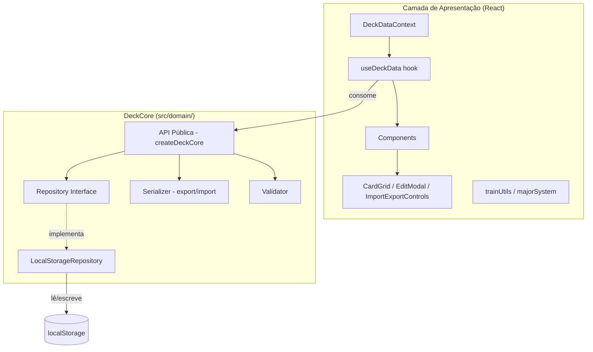

# Design: Domain Layer Extraction (DeckCore)

## Overview

Este design descreve a extração da lógica de gestão de cartas do aplicativo Memory Deck para uma biblioteca de domínio independente chamada DeckCore, localizada em `src/domain/`. Atualmente, a persistência (localStorage), serialização e validação estão acopladas diretamente nos componentes React (`DeckDataContext.tsx`, `ImportExportControls.tsx`). A DeckCore encapsulará essas responsabilidades atrás de uma API limpa baseada no padrão Repository, permitindo que a camada de apresentação consuma dados sem conhecer detalhes de persistência.

A biblioteca será puro TypeScript sem dependências de React ou qualquer framework de UI.

## Architecture



A arquitetura segue uma separação clara:

- **DeckCore** é responsável por: persistência (via Repository), serialização/desserialização (export/import), e validação de DeckEntry/DeckData.
- **Camada de Apresentação** mantém: agrupamento por range, cálculos de porcentagem, lógica de treino (shuffle, filterByRange, filterByDigit), e toda a interação com React (context, hooks, componentes).

O padrão Factory (`createDeckCore`) recebe uma instância de Repository e retorna a API pública, facilitando testes com repositórios mock.

## Components and Interfaces

### Repository Interface

```typescript
// src/domain/repository.ts
export interface Repository {
  getAll(): DeckData;
  getOne(key: string): DeckEntry | undefined;
  saveCard(key: string, entry: DeckEntry): void;
  importAll(data: DeckData): void;
}
```

### LocalStorageRepository

```typescript
// src/domain/localStorageRepository.ts
export class LocalStorageRepository implements Repository {
  private readonly storageKey = 'pao-major-system';

  getAll(): DeckData { /* parse localStorage, return {} on failure */ }
  getOne(key: string): DeckEntry | undefined { /* getAll()[key] */ }
  saveCard(key: string, entry: DeckEntry): void { /* merge + persist */ }
  importAll(data: DeckData): void { /* overwrite localStorage */ }
}
```

### Serializer (Export/Import)

```typescript
// src/domain/serializer.ts
export function exportDeck(data: DeckData): string {
  // JSON.stringify with 2-space indent
}

export function importDeck(json: string): DeckData {
  // parse, validate, return or throw
}
```

### Validator

```typescript
// src/domain/validator.ts
export function validateDeckEntry(entry: unknown): entry is DeckEntry {
  // check persona, action, object, image are strings
}

export function validateDeckData(data: unknown): data is DeckData {
  // check keys are "00"-"99", values pass validateDeckEntry
}
```

### API Pública (Factory)

```typescript
// src/domain/index.ts
export interface DeckCoreAPI {
  getAll(): DeckData;
  getOne(key: string): DeckEntry | undefined;
  saveCard(key: string, entry: DeckEntry): void;
  importCards(json: string): void;  // parse + validate + persist
  exportCards(): string;            // getAll + serialize
}

export function createDeckCore(repo: Repository): DeckCoreAPI { ... }

// Instância pré-configurada para uso direto
export const deckCore: DeckCoreAPI = createDeckCore(new LocalStorageRepository());

// Re-export types
export type { DeckEntry, DeckData } from './types';
export type { Repository } from './repository';
```

### File Structure

```
src/domain/
├── index.ts                  # createDeckCore, deckCore instance, re-exports
├── types.ts                  # DeckEntry, DeckData (moved from src/types.ts)
├── repository.ts             # Repository interface
├── localStorageRepository.ts # LocalStorageRepository class
├── serializer.ts             # exportDeck, importDeck
└── validator.ts              # validateDeckEntry, validateDeckData
```

## Data Models

### DeckEntry

```typescript
export interface DeckEntry {
  persona: string;
  action: string;
  object: string;
  image: string;
}
```

Sem alterações na estrutura existente. Os quatro campos são strings (podem ser vazias para cartas não preenchidas).

### DeckData

```typescript
export type DeckData = Record<string, DeckEntry>;
```

As chaves são strings numéricas de "00" a "99". A validação na importação garante que apenas chaves nesse range são aceitas e que cada valor é um DeckEntry válido.

### Validation Rules

| Regra | Descrição |
|-------|-----------|
| Chave válida | String numérica, 2 dígitos, range 00-99 |
| DeckEntry válido | Objeto com `persona`, `action`, `object`, `image` como strings |
| DeckData válido | Todas as chaves são válidas e todos os valores são DeckEntry válidos |

### Error Types

A DeckCore usa `Result`-style returns para operações de importação:

```typescript
export type ImportResult = 
  | { success: true; data: DeckData }
  | { success: false; error: string };
```

Isso evita exceções para fluxos esperados (JSON inválido, estrutura incorreta) e mantém a API previsível.


## Correctness Properties

*A property is a characteristic or behavior that should hold true across all valid executions of a system — essentially, a formal statement about what the system should do. Properties serve as the bridge between human-readable specifications and machine-verifiable correctness guarantees.*

### Property 1: LocalStorageRepository round-trip

*For any* valid DeckData, persisting it via `importAll` and then calling `getAll` should return a DeckData equivalent to the original.

**Validates: Requirements 2.1, 2.2**

### Property 2: saveCard updates persisted data

*For any* existing DeckData, any valid key (string "00"-"99"), and any valid DeckEntry, calling `saveCard(key, entry)` and then `getAll()` should return data where `data[key]` equals the saved entry, and all other entries remain unchanged.

**Validates: Requirements 2.5**

### Property 3: importAll replaces all data

*For any* two valid DeckData objects (old and new), if old is persisted first and then `importAll(new)` is called, `getAll()` should return exactly the new DeckData with no traces of the old data.

**Validates: Requirements 2.6**

### Property 4: Export format uses 2-space indentation

*For any* valid DeckData, `exportDeck(data)` should produce a string equal to `JSON.stringify(data, null, 2)`.

**Validates: Requirements 3.2**

### Property 5: Serialization round-trip

*For any* valid DeckData, `importDeck(exportDeck(data))` should produce a DeckData equivalent to the original. Conversely, for any valid JSON string representing a DeckData, `exportDeck(importDeck(json))` should produce an equivalent JSON string.

**Validates: Requirements 3.1, 3.3, 4.1, 4.5**

### Property 6: Invalid input rejection

*For any* string that is either malformed JSON or valid JSON that does not conform to the DeckData structure, `importDeck` should return a failure result with a descriptive error message.

**Validates: Requirements 4.3, 4.4, 5.3**

### Property 7: Validation correctness

*For any* object, `validateDeckEntry` should return true if and only if the object has exactly the fields `persona`, `action`, `object`, and `image` all typed as strings. *For any* Record, `validateDeckData` should return true if and only if all keys are numeric strings in the range "00"-"99" and all values pass `validateDeckEntry`.

**Validates: Requirements 5.1, 5.2**

## Error Handling

| Cenário | Comportamento | Tipo de Retorno |
|---------|---------------|-----------------|
| localStorage com JSON malformado | `getAll()` retorna `{}` | `DeckData` (vazio) |
| localStorage vazio/sem chave | `getAll()` retorna `{}` | `DeckData` (vazio) |
| Import de JSON malformado | Retorna `ImportResult` com `success: false` e mensagem de erro | `ImportResult` |
| Import de JSON válido mas estrutura inválida | Retorna `ImportResult` com `success: false` e mensagem de erro | `ImportResult` |
| Chave fora do range 00-99 no import | Rejeitado na validação com erro descritivo | `ImportResult` |
| DeckEntry com campos ausentes/tipo errado | Rejeitado na validação com erro descritivo | `ImportResult` |

A DeckCore não lança exceções para fluxos esperados. Erros de persistência do localStorage (quota excedida, etc.) propagam naturalmente como exceções do runtime, pois são condições excepcionais fora do controle da biblioteca.

## Testing Strategy

### Abordagem Dual: Unit Tests + Property-Based Tests

A estratégia de testes combina testes unitários para exemplos específicos e edge cases com testes baseados em propriedades para validação universal.

### Property-Based Testing

- **Biblioteca**: `fast-check` (já presente no projeto como devDependency)
- **Iterações mínimas**: 100 por propriedade
- **Cada teste deve referenciar a propriedade do design com um comentário no formato**:
  `// Feature: domain-layer-extraction, Property {N}: {título}`
- **Cada propriedade de correctness DEVE ser implementada por um ÚNICO teste property-based**

#### Generators necessários

- `arbitraryDeckEntry`: gera DeckEntry com strings aleatórias para persona, action, object, image
- `arbitraryDeckKey`: gera string numérica "00"-"99"
- `arbitraryDeckData`: gera Record<string, DeckEntry> com chaves válidas
- `arbitraryInvalidDeckEntry`: gera objetos que falham na validação (campos ausentes, tipos errados)
- `arbitraryMalformedJson`: gera strings que não são JSON válido

#### Mapeamento de Propriedades para Testes

| Propriedade | Arquivo de Teste | Descrição |
|-------------|-----------------|-----------|
| Property 1 | `src/domain/localStorageRepository.property.test.ts` | Round-trip importAll → getAll |
| Property 2 | `src/domain/localStorageRepository.property.test.ts` | saveCard preserva outras entradas |
| Property 3 | `src/domain/localStorageRepository.property.test.ts` | importAll substitui dados anteriores |
| Property 4 | `src/domain/serializer.property.test.ts` | Formato com indentação 2 espaços |
| Property 5 | `src/domain/serializer.property.test.ts` | Round-trip export ↔ import |
| Property 6 | `src/domain/serializer.property.test.ts` | Rejeição de input inválido |
| Property 7 | `src/domain/validator.property.test.ts` | Validação correta de DeckEntry e DeckData |

### Unit Tests

Testes unitários focam em:

- **Edge cases do LocalStorageRepository**: localStorage vazio, JSON malformado, quota excedida
- **Exemplos concretos de validação**: DeckEntry com campo faltando, chave "100" (fora do range), chave "abc"
- **Integração da API pública**: `createDeckCore` com mock repository, fluxo completo import → export
- **Instância pré-configurada**: verificar que `deckCore` exportado funciona com LocalStorageRepository

| Arquivo de Teste | Escopo |
|-----------------|--------|
| `src/domain/localStorageRepository.test.ts` | Edge cases de persistência |
| `src/domain/serializer.test.ts` | Exemplos concretos de import/export |
| `src/domain/validator.test.ts` | Exemplos de validação |
| `src/domain/index.test.ts` | Integração da API pública |
