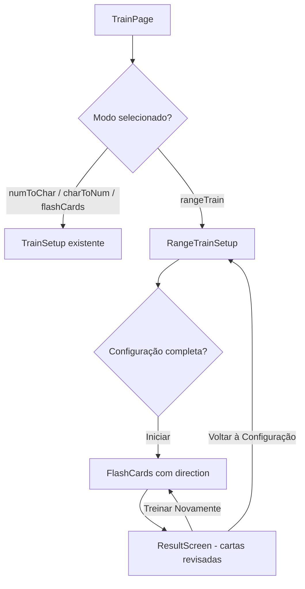

# Documento de Design: Treino Baseado em Range

## Visão Geral

Esta feature adiciona uma nova modalidade de treino ao aplicativo de flashcards do Sistema Major, permitindo que o usuário filtre cartões por range (ex: 00-09, 10-19) ou por dígito individual (ex: todos os cartões contendo o dígito 3). Após selecionar o filtro e a direção (número→personagem ou personagem→número), o usuário pratica com flashcards aleatórios do conjunto filtrado.

A implementação se integra à `TrainPage` existente, adicionando um novo modo "Treino por Range" ao seletor de modos do `TrainSetup`. Quando selecionado, uma tela de configuração dedicada (`RangeTrainSetup`) é exibida, onde o usuário escolhe o modo de seleção (range ou dígito), o filtro específico e a direção do flashcard. O treino reutiliza o componente `FlashCards` existente, estendido com uma prop `direction` que controla o que aparece na frente e no verso da carta. Na direção "numToChar", o número aparece na frente e o personagem no verso; na direção "charToNum", o personagem aparece na frente e o número no verso.

## Arquitetura

A feature segue a arquitetura existente do projeto: componentes React com estado local, utilitários puros para lógica de filtragem e contexto global para dados do deck.



### Decisões de Design

1. **Reutilização do componente FlashCards**: O componente `FlashCards` existente já implementa o fluxo de flashcard (clique para revelar). Basta adicionar uma prop `direction` para controlar o que aparece na frente e no verso da carta. Na direção `'numToChar'`, o número fica na frente e o personagem no verso (comportamento atual). Na direção `'charToNum'`, o personagem fica na frente e o número no verso.

2. **Novo tipo de modo no TrainMode**: Adicionamos `'rangeTrain'` ao tipo `TrainMode` para representar a nova modalidade no seletor de modos.

3. **Lógica de filtragem como funções puras**: As funções `filterByRange` e `filterByDigit` ficam em `trainUtils.ts`, facilitando testes unitários e property-based tests.

4. **Estado local no RangeTrainSetup**: O componente `RangeTrainSetup` gerencia internamente o modo de seleção (range/dígito), o filtro selecionado e a direção, emitindo apenas o evento `onStart` com as entries filtradas e a direção escolhida.

5. **Sem pontuação/rodadas**: Diferente dos modos quiz (numToChar/charToNum), o treino por range usa flashcards sem pontuação. O usuário percorre todos os cartões filtrados e a tela de resultado exibe apenas a contagem de cartas revisadas.

## Componentes e Interfaces

### Novos Componentes

#### `RangeTrainSetup`
Tela de configuração para o treino por range/dígito.

```typescript
interface RangeTrainSetupProps {
  filledEntries: FilledEntry[];
  onStart: (filteredEntries: FilledEntry[], direction: TrainDirection) => void;
}
```

**Responsabilidades:**
- Exibir seletor de modo de seleção ("Por Range" / "Por Dígito")
- Exibir grid de ranges (00-09 a 90-99) ou dígitos (0-9) conforme o modo
- Destacar visualmente o item selecionado
- Desabilitar itens sem cartões preenchidos
- Exibir contagem de cartões preenchidos para o filtro selecionado
- Exibir seletor de direção (numToChar / charToNum)
- Habilitar/desabilitar botão de iniciar conforme validação

### Componentes Modificados

#### `FlashCards`
Adicionar prop `direction` para controlar a orientação da carta.

```typescript
interface FlashCardsProps {
  filledEntries: FilledEntry[];
  direction?: TrainDirection; // padrão: 'numToChar'
  onComplete: (cardCount: number) => void;
}
```

**Comportamento por direção:**
- `'numToChar'` (padrão): Frente exibe o número, verso exibe personagem (imagem + nome). Comportamento atual preservado.
- `'charToNum'`: Frente exibe personagem (imagem + nome), verso exibe o número.

#### `TrainSetup`
Adicionar o modo `'rangeTrain'` à lista de modos disponíveis.

#### `TrainPage`
Gerenciar o fluxo quando o modo é `'rangeTrain'`:
- Na fase `setup`, exibir `RangeTrainSetup` em vez de `TrainSetup`
- Na fase `challenge`, usar `FlashCards` com entries filtradas e a `direction` escolhida
- Na fase `result`, exibir contagem de cartas revisadas, permitir "Treinar Novamente" (mesma config) ou "Voltar à Configuração"

### Novas Funções Utilitárias (em `trainUtils.ts`)

```typescript
// Tipos
type SelectionMode = 'range' | 'digit';
type TrainDirection = 'numToChar' | 'charToNum';

// Filtra entries cujo número pertence ao range (ex: startDigit=1 → 10-19)
function filterByRange(entries: FilledEntry[], rangeStart: number): FilledEntry[];

// Filtra entries cujo número contém o dígito em qualquer posição
function filterByDigit(entries: FilledEntry[], digit: number): FilledEntry[];

// Retorna os números (00-99) que pertencem a um range
function getNumbersInRange(rangeStart: number): string[];

// Retorna os números (00-99) que contêm um dígito
function getNumbersWithDigit(digit: number): string[];

// Conta cartões preenchidos para um range
function countFilledInRange(entries: FilledEntry[], rangeStart: number): number;

// Conta cartões preenchidos para um dígito
function countFilledWithDigit(entries: FilledEntry[], digit: number): number;
```

## Modelos de Dados

### Tipos Novos

```typescript
// Adicionado ao TrainMode existente
export type TrainMode = 'numToChar' | 'charToNum' | 'flashCards' | 'rangeTrain';

// Novos tipos para a feature
export type SelectionMode = 'range' | 'digit';
export type TrainDirection = 'numToChar' | 'charToNum';

// Configuração salva para "Treinar Novamente"
export interface RangeTrainConfig {
  selectionMode: SelectionMode;
  selectedValue: number; // 0-9 para range (dezena) ou 0-9 para dígito
  direction: TrainDirection;
}
```

### Estrutura de Dados Existente (sem alteração)

O `DeckData` (Record<string, DeckEntry>) permanece inalterado. As chaves são strings de 2 dígitos ("00" a "99"), e cada `DeckEntry` contém `persona`, `action`, `object` e `image`.

A filtragem opera sobre `FilledEntry[]` (entries com persona preenchida), que já é produzida pelo hook `useDeckData.getFilledEntries()`.

### Mapeamento de Ranges e Dígitos

- **Range X**: números de `X0` a `X9` (ex: range 1 = "10" a "19")
- **Dígito D**: todos os números `XY` onde `X === D` ou `Y === D` (ex: dígito 3 = "03", "13", "23", "30"-"39", "43", "53", "63", "73", "83", "93")


## Propriedades de Corretude

*Uma propriedade é uma característica ou comportamento que deve ser verdadeiro em todas as execuções válidas de um sistema — essencialmente, uma declaração formal sobre o que o sistema deve fazer. Propriedades servem como ponte entre especificações legíveis por humanos e garantias de corretude verificáveis por máquina.*

### Propriedade 1: Filtragem por range retorna apenas entradas do range

*Para qualquer* conjunto de `FilledEntry[]` e qualquer range `R` (0-9), `filterByRange(entries, R)` deve retornar apenas entradas cujo número de dois dígitos está no intervalo `[R*10, R*10+9]`. Ou seja, para toda entrada no resultado, `Math.floor(parseInt(entry.num) / 10) === R`.

**Valida: Requisitos 5.1**

### Propriedade 2: Filtragem por dígito retorna apenas entradas contendo o dígito

*Para qualquer* conjunto de `FilledEntry[]` e qualquer dígito `D` (0-9), `filterByDigit(entries, D)` deve retornar apenas entradas cujo número de dois dígitos contém `D` em qualquer posição (dezena ou unidade). Ou seja, para toda entrada no resultado, `entry.num.includes(String(D))` é verdadeiro. Além disso, nenhuma entrada que contenha o dígito deve ser omitida do resultado.

**Valida: Requisitos 2.4, 5.2**

### Propriedade 3: Contagem de cartões preenchidos corresponde ao filtro

*Para qualquer* conjunto de `FilledEntry[]` e qualquer filtro (range ou dígito), a contagem retornada por `countFilledInRange` ou `countFilledWithDigit` deve ser igual ao comprimento do array retornado por `filterByRange` ou `filterByDigit`, respectivamente.

**Valida: Requisitos 1.5, 2.5**

### Propriedade 4: Opções sem cartões preenchidos são desabilitadas

*Para qualquer* conjunto de `FilledEntry[]` e qualquer opção de filtro (range 0-9 ou dígito 0-9), se a contagem de cartões preenchidos para aquela opção é zero, então a opção deve estar desabilitada (não selecionável).

**Valida: Requisitos 1.6, 2.6**

### Propriedade 5: Seleção única — apenas um item selecionado por vez

*Para qualquer* sequência de seleções de range ou dígito, após selecionar um novo item, apenas o último item selecionado deve estar ativo. Todos os itens anteriormente selecionados devem estar inativos.

**Valida: Requisitos 1.4, 2.3**

### Propriedade 6: Botão de iniciar habilitado quando filtro tem cartões

*Para qualquer* estado do deck e qualquer filtro selecionado (range ou dígito), o botão de iniciar treino deve estar habilitado se e somente se o filtro selecionado possui pelo menos 1 cartão preenchido.

**Valida: Requisitos 4.1, 4.2**

### Propriedade 7: Direção do flashcard determina conteúdo da frente e do verso

*Para qualquer* `FilledEntry` e qualquer direção (`'numToChar'` ou `'charToNum'`), o componente FlashCards deve exibir na frente o número quando a direção é `'numToChar'` e o personagem quando a direção é `'charToNum'`. O verso deve exibir o conteúdo oposto. A prop `direction` padrão (`'numToChar'`) deve preservar o comportamento original do componente.

**Valida: Requisitos 3.4, 3.5, 5.3**

## Tratamento de Erros

| Cenário | Tratamento |
|---------|-----------|
| Range/dígito sem cartões preenchidos | Opção exibida como desabilitada (acinzentada), não selecionável |
| Nenhum filtro selecionado | Botão "Começar Treino" desabilitado |
| Deck vazio (nenhum cartão preenchido) | Todos os ranges e dígitos desabilitados; botão de iniciar desabilitado |
| Erro ao carregar imagem do personagem | Fallback para emoji 🧑 (comportamento existente no componente FlashCards) |

## Estratégia de Testes

### Testes Unitários

Testes unitários focam em exemplos específicos, edge cases e condições de erro:

- **filterByRange**: Testar com range 0 (00-09), range 9 (90-99), deck vazio, deck com todos os cartões preenchidos
- **filterByDigit**: Testar com dígito 0 (inclui 00-09 e X0), dígito 5, deck vazio
- **countFilledInRange / countFilledWithDigit**: Verificar contagens com dados conhecidos
- **Componente RangeTrainSetup**: Testar renderização inicial (modo padrão "Por Range", direção padrão "numToChar"), troca de modo de seleção, seleção de range/dígito, estado do botão de iniciar
- **Componente FlashCards com direction**: Testar que a frente e o verso exibem o conteúdo correto conforme a direção (`'numToChar'` = número na frente; `'charToNum'` = personagem na frente)
- **Integração TrainPage**: Testar fluxo completo setup → flashcards → result → retry

### Testes Property-Based

Utilizar a biblioteca `fast-check` (já presente no projeto) para testes de propriedade. Cada teste deve executar no mínimo 100 iterações.

Cada propriedade de corretude definida acima deve ser implementada por um **único** teste property-based, com o seguinte formato de tag em comentário:

```
// Feature: range-based-training, Property {N}: {descrição}
```

**Propriedades a implementar:**

1. **Property 1**: Gerar `FilledEntry[]` aleatórias e um range aleatório (0-9). Verificar que todas as entradas retornadas por `filterByRange` pertencem ao range.
2. **Property 2**: Gerar `FilledEntry[]` aleatórias e um dígito aleatório (0-9). Verificar que todas as entradas retornadas por `filterByDigit` contêm o dígito, e que nenhuma entrada válida foi omitida.
3. **Property 3**: Gerar `FilledEntry[]` aleatórias e um filtro aleatório. Verificar que `countFilledInRange` === `filterByRange(...).length` (e análogo para dígito).
4. **Property 4**: Gerar `FilledEntry[]` aleatórias e verificar que para todo range/dígito com contagem 0, a opção é desabilitada.
5. **Property 5**: Gerar sequência aleatória de seleções e verificar que apenas a última está ativa.
6. **Property 6**: Gerar `FilledEntry[]` aleatórias e um filtro aleatório. Verificar que o botão está habilitado sse a contagem filtrada >= 1.
7. **Property 7**: Gerar `FilledEntry` aleatória e uma direção aleatória. Verificar que o conteúdo da frente e do verso do flashcard corresponde à direção selecionada.
