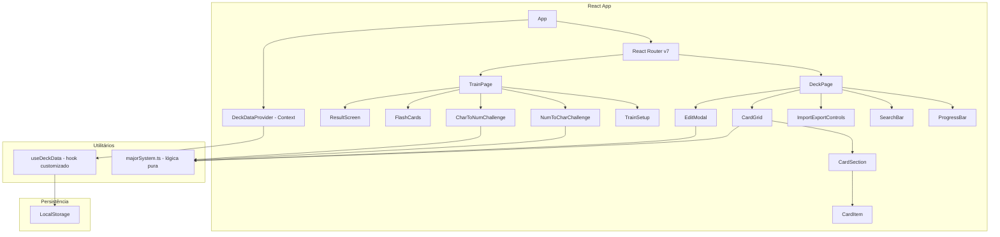

# Documento de Design — Migração para React

## Visão Geral

Este documento descreve o design técnico para migrar a aplicação "Memory Deck" de vanilla JavaScript para React. A aplicação é uma PWA de memorização baseada no Sistema Major, com duas páginas principais (Deck e Treino) e persistência via LocalStorage.

A migração adota uma abordagem de reescrita completa usando React 19 + Vite 8 + React Router v7, mantendo 100% da funcionalidade existente, o estilo visual e a compatibilidade PWA. O estado global dos cartões será compartilhado via Context API com um hook customizado, e toda a lógica do Sistema Major será encapsulada em um módulo utilitário puro (sem dependências de React).

### Versões das Bibliotecas

| Biblioteca | Versão |
|---|---|
| React | 19.x (com React Compiler production-ready) |
| React Router | 7.13.x (pacote unificado `react-router`) |
| Vite | 8.x (Rolldown como bundler unificado) |
| Vitest | 4.1.x (compatível com Vite 8) |
| fast-check | 4.1.x |
| vite-plugin-pwa | última versão compatível com Vite 8 |

### Decisões de Design

1. **Vite 8.x como bundler**: Escolhido por ser o padrão moderno para projetos React, com HMR rápido, configuração mínima e uso do Rolldown como bundler unificado para dev e produção.
2. **React Router v7**: Para navegação SPA entre Deck e Treino sem recarregar a página. Na v7, tudo é importado do pacote `react-router` (o pacote `react-router-dom` foi descontinuado).
3. **Context API + useReducer**: Para gerenciar o estado global dos cartões sem dependências externas (Redux seria excessivo para este escopo).
4. **CSS Modules ou arquivos CSS globais**: Manter os arquivos CSS existentes como globais para preservar o estilo visual sem refatoração desnecessária.
5. **vite-plugin-pwa**: Para gerar o Service Worker e manifest automaticamente no build de produção.

## Arquitetura



### Estrutura de Pastas

```
src/
├── main.jsx              # Entry point, renderiza App
├── App.jsx               # Layout global + Router + Provider
├── context/
│   └── DeckDataContext.jsx  # Context + Provider + Reducer
├── hooks/
│   └── useDeckData.js       # Hook customizado para acessar o contexto
├── utils/
│   └── majorSystem.js       # Lógica pura do Sistema Major (getConsonants, extractMajorConsonants)
├── pages/
│   ├── DeckPage.jsx         # Página do Deck
│   └── TrainPage.jsx        # Página do Treino
├── components/
│   ├── Header.jsx           # Header compartilhado com navegação
│   ├── ProgressBar.jsx      # Barra de progresso global
│   ├── CardGrid.jsx         # Grid com seções de cartões
│   ├── CardSection.jsx      # Seção individual (dezena)
│   ├── CardItem.jsx         # Cartão individual
│   ├── EditModal.jsx        # Modal de edição PAO
│   ├── SearchBar.jsx        # Campo de busca
│   ├── ImportExportControls.jsx  # Botões exportar/importar
│   ├── TrainSetup.jsx       # Tela de seleção de modo
│   ├── NumToCharChallenge.jsx   # Modo Número → Personagem
│   ├── CharToNumChallenge.jsx   # Modo Personagem → Número
│   ├── FlashCards.jsx        # Modo Flash Cards
│   └── ResultScreen.jsx      # Tela de resultado
├── style.css                 # Estilos globais (migrados)
└── train.css                 # Estilos do treino (migrados)
```

## Componentes e Interfaces

### App (App.jsx)

Componente raiz que envolve a aplicação com o `DeckDataProvider` e configura o React Router v7.

```jsx
// Props: nenhuma
// Responsabilidades:
// - Renderizar DeckDataProvider
// - Configurar BrowserRouter (importado de "react-router") com rotas / e /treino
// - Renderizar Header em todas as páginas
// Nota: Na v7, todos os imports vêm de "react-router" (não "react-router-dom")
```

### Header (Header.jsx)

```jsx
// Props: nenhuma (usa useLocation de "react-router")
// Renderiza: h1, subtitle, nav com links ativos
```

### DeckPage (DeckPage.jsx)

```jsx
// Props: nenhuma (usa useDeckData hook)
// Estado local: searchFilter (string), modalOpen (boolean), selectedCardNum (string | null)
// Renderiza: ProgressBar, SearchBar, ImportExportControls, CardGrid, EditModal
```

### CardGrid (CardGrid.jsx)

```jsx
// Props: { data: object, filter: string, onCardClick: (num: string) => void }
// Lógica: agrupa cartões em seções de 10, filtra por número/nome/consoantes
// Renderiza: lista de CardSection
```

### CardSection (CardSection.jsx)

```jsx
// Props: { start: number, end: number, cards: array, filledCount: number, onCardClick: fn }
// Renderiza: section-header + section-cards com CardItem
```

### CardItem (CardItem.jsx)

```jsx
// Props: { num: string, entry: { persona, action, object, image }, onClick: fn }
// Renderiza: card com número, imagem/placeholder, nome/???
```

### EditModal (EditModal.jsx)

```jsx
// Props: { isOpen: boolean, cardNum: string, entry: object, onSave: fn, onClose: fn }
// Estado local: persona, action, object, image (campos do formulário)
// Efeitos: atualizar campos quando cardNum muda, preview de imagem, colar da clipboard
// Eventos: Enter para salvar, Escape para fechar, click fora para fechar
```

### TrainPage (TrainPage.jsx)

```jsx
// Props: nenhuma (usa useDeckData hook)
// Estado local: mode, phase ('setup' | 'challenge' | 'result'), score, round, etc.
// Renderiza condicionalmente: TrainSetup, NumToCharChallenge, CharToNumChallenge, FlashCards, ResultScreen
```

### TrainSetup (TrainSetup.jsx)

```jsx
// Props: { filledCount: number, mode: string, onModeChange: fn, onStart: fn }
// Lógica: desabilita botão se cartões insuficientes (5 para desafios, 1 para flash)
```

### NumToCharChallenge (NumToCharChallenge.jsx)

```jsx
// Props: { filledEntries: array, onComplete: (score: number) => void }
// Estado local: round, score, currentChallenge, expectedIndex
// Lógica: 10 rodadas, 3 números + 5 opções (3 corretos + 2 distratores)
```

### CharToNumChallenge (CharToNumChallenge.jsx)

```jsx
// Props: { filledEntries: array, onComplete: (score: number) => void }
// Estado local: round, score, currentChallenge, expectedIndex
// Lógica: 10 rodadas, 3 personagens + 5 opções de números
```

### FlashCards (FlashCards.jsx)

```jsx
// Props: { filledEntries: array, onComplete: (total: number) => void }
// Estado local: deck (embaralhado), currentIndex, flipped
// Lógica: flip 3D, avanço automático após 1.5s
```

### ResultScreen (ResultScreen.jsx)

```jsx
// Props: { mode: string, score: number, totalRounds: number, totalCards: number, onRetry: fn }
// Lógica: emoji contextual (🏆/👍/💪), exibe pontuação ou contagem de cartas
```

## Modelos de Dados

### CardEntry (dados de um cartão)

```typescript
interface CardEntry {
  persona: string;  // Nome do personagem
  action: string;   // Ação associada
  object: string;   // Objeto associado
  image: string;    // URL da imagem
}
```

### DeckData (estado global)

```typescript
// Mapa de número (string "00"-"99") para CardEntry
type DeckData = Record<string, CardEntry>;
```

### DeckDataState (estado do contexto)

```typescript
interface DeckDataState {
  data: DeckData;
}
```

### DeckDataAction (ações do reducer)

```typescript
type DeckDataAction =
  | { type: 'SAVE_CARD'; num: string; entry: CardEntry }
  | { type: 'IMPORT_DATA'; data: DeckData }
  | { type: 'LOAD_DATA'; data: DeckData };
```

### FilledEntry (entrada preenchida para treino)

```typescript
interface FilledEntry {
  num: string;
  persona: string;
  action: string;
  object: string;
  image: string;
}
```

### ChallengeState (estado de uma rodada de treino)

```typescript
interface ChallengeState {
  ordered: FilledEntry[];      // Cartões na ordem correta
  choices: FilledEntry[];      // Opções embaralhadas (modo 1)
  numChoices?: string[];       // Opções de números (modo 2)
  mistakes: number;            // Erros na rodada atual
}
```

### Constantes do Sistema Major

```typescript
const MAJOR: Record<number, string[]> = {
  0: ['s', 'z'],
  1: ['t', 'd', 'th'],
  2: ['n'],
  3: ['m'],
  4: ['r'],
  5: ['l'],
  6: ['j', 'ch', 'sh'],
  7: ['g', 'c', 'k', 'q', 'ck'],
  8: ['v', 'f', 'ph'],
  9: ['p', 'b']
};
```

### Chave de LocalStorage

```
"pao-major-system"
```

Os dados são serializados como JSON e armazenados/lidos diretamente desta chave. O reducer persiste automaticamente no LocalStorage a cada ação `SAVE_CARD` ou `IMPORT_DATA`.


## Propriedades de Corretude

*Uma propriedade é uma característica ou comportamento que deve ser verdadeiro em todas as execuções válidas de um sistema — essencialmente, uma declaração formal sobre o que o sistema deve fazer. Propriedades servem como ponte entre especificações legíveis por humanos e garantias de corretude verificáveis por máquina.*

### Propriedade 1: Mapeamento do Sistema Major é correto

*Para qualquer* número de dois dígitos (0–99), `getConsonants(num)` deve retornar as consoantes correspondentes ao primeiro e segundo dígito conforme o mapeamento definido (0=s/z, 1=t/d/th, ..., 9=p/b), e o rótulo formatado deve conter ambos os conjuntos de consoantes.

**Valida: Requisitos 13.2**

### Propriedade 2: Extração de consoantes retorna apenas sons do Sistema Major

*Para qualquer* string de entrada, `extractMajorConsonants(name)` deve retornar apenas consoantes que pertencem ao mapeamento do Sistema Major, e sons multi-caractere (th, ch, sh, ck, ph) devem ser tratados como uma única unidade.

**Valida: Requisitos 13.3**

### Propriedade 3: Round-trip de persistência no LocalStorage

*Para qualquer* dado de cartão válido (CardEntry), salvar o cartão via reducer e depois ler do LocalStorage deve produzir dados equivalentes ao que foi salvo.

**Valida: Requisitos 3.4, 12.1, 12.2**

### Propriedade 4: Round-trip de importação de dados

*Para qualquer* objeto DeckData válido, importar os dados e depois exportar deve produzir dados equivalentes aos importados.

**Valida: Requisitos 5.2, 12.3**

### Propriedade 5: Grid renderiza 10 seções com 10 cartões cada

*Para qualquer* DeckData (incluindo vazio), o CardGrid sem filtro deve produzir exatamente 10 seções, cada uma com exatamente 10 cartões, cobrindo os números 00–99.

**Valida: Requisitos 2.1**

### Propriedade 6: Contagem de cartões preenchidos é consistente

*Para qualquer* DeckData, a contagem de cartões preenchidos exibida no cabeçalho de cada seção deve ser igual ao número de entradas naquela dezena que possuem o campo `persona` não-vazio (após trim).

**Valida: Requisitos 2.2, 6.1**

### Propriedade 7: CardItem renderiza corretamente baseado no estado do cartão

*Para qualquer* CardEntry, o CardItem deve: exibir o nome do personagem se `persona` for não-vazio, caso contrário "???"; exibir a imagem se `image` for não-vazio, caso contrário o placeholder; e aplicar a classe "filled" se e somente se `persona` for não-vazio (após trim).

**Valida: Requisitos 2.3, 2.4**

### Propriedade 8: Filtro de busca retorna apenas cartões correspondentes

*Para qualquer* DeckData e qualquer string de busca, todos os cartões retornados pelo filtro devem ter correspondência no número, nome do personagem ou rótulo de consoantes; e seções sem nenhum cartão correspondente não devem ser exibidas.

**Valida: Requisitos 4.1, 4.2**

### Propriedade 9: Botão de início do treino respeita mínimo de cartões

*Para qualquer* DeckData e qualquer modo de treino selecionado, o botão "Começar Treino" deve estar desabilitado se: o modo for "numToChar" ou "charToNum" e houver menos de 5 cartões preenchidos; ou o modo for "flashCards" e houver 0 cartões preenchidos. Caso contrário, deve estar habilitado.

**Valida: Requisitos 7.3, 7.4, 7.5**

### Propriedade 10: Geração de rodada de desafio é válida

*Para qualquer* conjunto de entradas preenchidas (≥5) e qualquer modo de desafio, cada rodada gerada deve conter exatamente 3 alvos e 5 opções totais (3 corretos + 2 distratores), onde os 3 alvos estão contidos nas 5 opções e os 2 distratores são diferentes dos alvos.

**Valida: Requisitos 8.1, 9.1**

### Propriedade 11: Shuffle dos flash cards preserva todos os elementos

*Para qualquer* conjunto de entradas preenchidas, o deck embaralhado para flash cards deve conter exatamente os mesmos elementos (mesmo tamanho e mesmos itens) que o conjunto original.

**Valida: Requisitos 10.1**

### Propriedade 12: Progresso dos flash cards é calculado corretamente

*Para qualquer* deck de flash cards de tamanho N e qualquer índice atual i (0 ≤ i < N), o progresso exibido deve ser "Carta {i+1} / {N}" e a porcentagem deve ser `Math.round((i / N) * 100)`.

**Valida: Requisitos 10.4**

### Propriedade 13: Emoji do resultado segue os limiares corretos

*Para qualquer* pontuação (score) e total de rodadas, o emoji exibido deve ser: 🏆 se a porcentagem for ≥80%, 👍 se for ≥50% e <80%, 💪 se for <50%.

**Valida: Requisitos 11.1**

### Propriedade 14: Modal exibe consoantes corretas para o número do cartão

*Para qualquer* número de cartão (00–99), ao abrir o EditModal, as consoantes exibidas devem corresponder exatamente ao resultado de `getConsonants(num)`.

**Valida: Requisitos 3.1**

## Tratamento de Erros

| Cenário | Comportamento Esperado |
|---------|----------------------|
| URL de imagem inválida no EditModal | Exibir ícone ❌ na pré-visualização (via `onerror` no ``) |
| Arquivo JSON inválido na importação | Exibir `alert()` informando que o arquivo é inválido; manter dados atuais |
| LocalStorage vazio na inicialização | Inicializar com objeto vazio `{}` |
| Clipboard API indisponível | Falhar silenciosamente (try/catch no botão colar) |
| Cartões insuficientes para treino | Desabilitar botão "Começar Treino" com feedback visual |
| Imagem do cartão falha ao carregar no grid/treino | Exibir placeholder (🧑 ou 🃏) via `onerror` |
| Service Worker falha ao registrar | Aplicação funciona normalmente sem cache offline |

## Estratégia de Testes

### Abordagem Dual

A estratégia de testes combina testes unitários e testes baseados em propriedades para cobertura abrangente:

- **Testes unitários**: Verificam exemplos específicos, edge cases e condições de erro
- **Testes de propriedade**: Verificam propriedades universais em todas as entradas possíveis
- Ambos são complementares e necessários

### Biblioteca de Testes

- **Framework**: Vitest 4.1.x (integrado com Vite 8)
- **Testes de propriedade**: fast-check 4.1.x (biblioteca PBT para JavaScript/TypeScript)
- **Testes de componente**: React Testing Library

### Configuração dos Testes de Propriedade

- Mínimo de 100 iterações por teste de propriedade
- Cada teste deve referenciar a propriedade do documento de design
- Formato do tag: **Feature: react-migration, Property {número}: {texto da propriedade}**
- Cada propriedade de corretude deve ser implementada por um ÚNICO teste baseado em propriedade

### Testes Unitários (Exemplos e Edge Cases)

Os testes unitários devem focar em:

- Navegação entre páginas (rotas corretas, link ativo)
- Interações do EditModal (abrir, salvar com Enter, fechar com Escape, colar clipboard)
- Feedback visual do treino (animação shake, feedback "Perfeito!", avanço de rodada)
- Fluxo completo do treino (10 rodadas → ResultScreen)
- Flash cards (flip 3D, avanço automático após 1.5s)
- ResultScreen para modo Flash Cards (exibe contagem em vez de pontuação)
- Edge cases: JSON inválido na importação, URL de imagem inválida, LocalStorage vazio

### Testes de Propriedade (Propriedades Universais)

Cada propriedade listada na seção "Propriedades de Corretude" deve ter um teste correspondente usando fast-check:

1. **Propriedade 1**: Gerar números aleatórios 0–99, verificar mapeamento
2. **Propriedade 2**: Gerar strings aleatórias, verificar que saída contém apenas sons válidos
3. **Propriedade 3**: Gerar CardEntry aleatório, salvar e ler do LocalStorage
4. **Propriedade 4**: Gerar DeckData aleatório, importar e exportar
5. **Propriedade 5**: Gerar DeckData aleatório, verificar estrutura do grid
6. **Propriedade 6**: Gerar DeckData aleatório, verificar contagens por seção
7. **Propriedade 7**: Gerar CardEntry aleatório, verificar renderização
8. **Propriedade 8**: Gerar DeckData e string de busca aleatórios, verificar filtro
9. **Propriedade 9**: Gerar DeckData com quantidade variável de preenchidos, verificar estado do botão
10. **Propriedade 10**: Gerar entradas preenchidas aleatórias (≥5), verificar estrutura da rodada
11. **Propriedade 11**: Gerar entradas preenchidas aleatórias, verificar que shuffle preserva elementos
12. **Propriedade 12**: Gerar tamanho de deck e índice aleatórios, verificar cálculo de progresso
13. **Propriedade 13**: Gerar score e total aleatórios, verificar emoji correto
14. **Propriedade 14**: Gerar número 00–99 aleatório, verificar consoantes no modal
