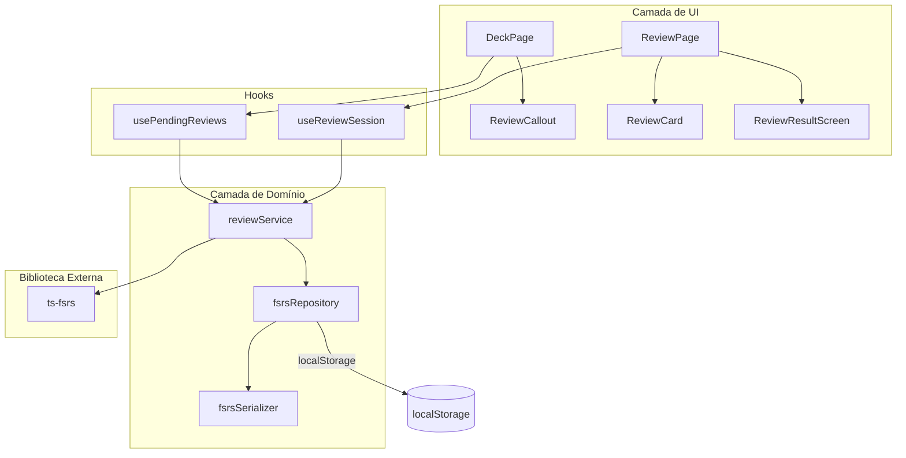
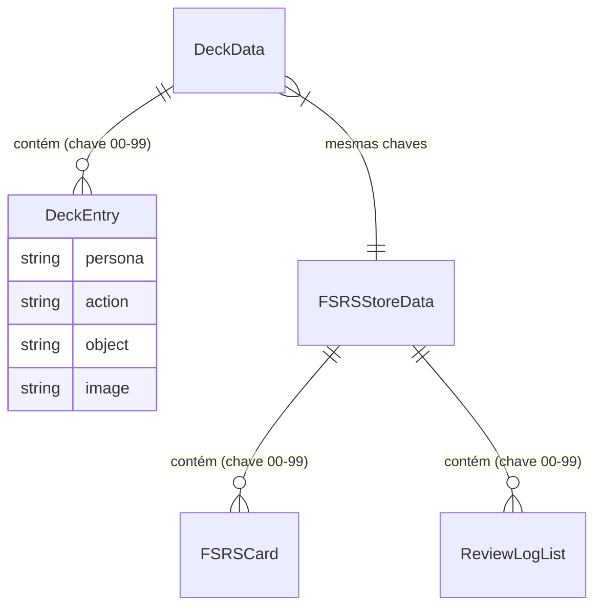

# Documento de Design: Revisão por Repetição Espaçada

## Visão Geral

Esta feature adiciona um sistema de revisão por repetição espaçada ao Memory Deck, integrando a biblioteca `ts-fsrs` para agendar e gerenciar sessões de revisão de flash cards. O sistema calcula quais cards estão pendentes de revisão com base nos metadados FSRS, exibe um callout informativo na página principal e oferece uma página dedicada de revisão onde o usuário avalia sua lembrança de cada card.

A arquitetura segue os padrões já estabelecidos no projeto: camada de domínio com repositório e serialização, contexto React para estado global, hooks customizados e componentes de UI. Os dados FSRS são persistidos no localStorage de forma independente dos dados do deck existente.

## Arquitetura



### Decisões de Arquitetura

1. **Repositório FSRS separado**: Os dados FSRS são armazenados em uma chave localStorage separada (`fsrs-data`) para não interferir com os dados do deck existente (`pao-major-system`). Isso mantém a compatibilidade retroativa e permite evolução independente.

2. **Service layer**: Um `reviewService` encapsula a lógica de negócio (cálculo de pendentes, processamento de avaliações) e serve como ponte entre os hooks React e a biblioteca `ts-fsrs`. Isso mantém os componentes livres de lógica de domínio.

3. **Hooks dedicados**: `usePendingReviews` para o callout na DeckPage e `useReviewSession` para gerenciar o estado da sessão de revisão. Seguem o padrão do `useDeckData` existente.

4. **Rota dedicada**: A revisão acontece em `/revisao`, seguindo o padrão da rota `/treino` existente.

## Componentes e Interfaces

### Camada de Domínio

#### `fsrsSerializer.ts`
Responsável por serializar/desserializar os dados FSRS para/do localStorage.

```typescript
interface FSRSStoreData {
  cards: Record<string, SerializedFSRSCard>;
  logs: Record<string, SerializedReviewLog[]>;
}

function serializeFSRSStore(data: FSRSStoreData): string;
function deserializeFSRSStore(json: string): FSRSStoreData | null;
```

A serialização converte objetos `Date` para strings ISO 8601 e a desserialização reconverte. Retorna `null` para dados inválidos ou corrompidos.

#### `fsrsRepository.ts`
Persistência dos dados FSRS no localStorage.

```typescript
interface FSRSRepository {
  getCard(key: string): Card | null;
  getAllCards(): Record<string, Card>;
  saveReview(key: string, card: Card, log: ReviewLog): void;
  loadAll(): { cards: Record<string, Card>; logs: Record<string, ReviewLog[]> };
}
```

Usa a chave `fsrs-data` no localStorage. Ao carregar dados corrompidos, retorna estado vazio sem lançar exceção.

#### `reviewService.ts`
Lógica de negócio para revisão.

```typescript
interface ReviewService {
  getPendingCards(deckData: DeckData, now?: Date): PendingCard[];
  processRating(key: string, card: Card, rating: Rating): { card: Card; log: ReviewLog };
  getOrCreateCard(key: string): Card;
}

interface PendingCard {
  key: string;
  entry: DeckEntry;
  fsrsCard: Card;
}
```

- `getPendingCards`: Filtra DeckEntries preenchidos cujo Card_FSRS tem `due <= now` ou que não possuem Card_FSRS (cards novos).
- `processRating`: Invoca `fsrs.repeat()` da biblioteca `ts-fsrs` e retorna o novo estado.
- `getOrCreateCard`: Retorna o Card_FSRS existente ou cria um novo via `createEmptyCard()`.

### Hooks

#### `usePendingReviews`
```typescript
function usePendingReviews(): {
  pendingCount: number;
  pendingCards: PendingCard[];
}
```

Consome o `DeckDataContext` existente e o `fsrsRepository` para calcular cards pendentes.

#### `useReviewSession`
```typescript
function useReviewSession(pendingCards: PendingCard[]): {
  currentCard: PendingCard | null;
  isFlipped: boolean;
  progress: { current: number; total: number };
  flip: () => void;
  rate: (rating: Rating) => void;
  isComplete: boolean;
  totalReviewed: number;
}
```

Gerencia o estado da sessão: card atual, flip, avaliação, avanço e conclusão.

### Componentes de UI

#### `ReviewCallout`
Exibido na DeckPage abaixo do ProgressBar quando há cards pendentes.

```typescript
interface ReviewCalloutProps {
  pendingCount: number;
}
```

Mostra o número de cards pendentes e um botão "Revisar agora" que navega para `/revisao`.

#### `ReviewCard`
Card de revisão com flip e botões de avaliação.

```typescript
interface ReviewCardProps {
  card: PendingCard;
  isFlipped: boolean;
  onFlip: () => void;
  onRate: (rating: Rating) => void;
}
```

- Frente: exibe o número do card
- Verso: exibe persona e imagem, com 4 botões de Rating (Again, Hard, Good, Easy)

#### `ReviewResultScreen`
Tela exibida ao final da sessão.

```typescript
interface ReviewResultScreenProps {
  totalReviewed: number;
  onReviewAgain: () => void;
  onBackToDeck: () => void;
}
```

#### `ReviewPage`
Página que orquestra a sessão de revisão.

- Usa `usePendingReviews` para obter cards pendentes
- Usa `useReviewSession` para gerenciar o fluxo
- Redireciona para `/` se não houver cards pendentes
- Exibe `ReviewCard` durante a sessão e `ReviewResultScreen` ao final

## Modelos de Dados

### Dados FSRS no localStorage

Chave: `fsrs-data`

```typescript
// Formato armazenado (serializado)
interface FSRSStoreData {
  cards: Record<string, SerializedFSRSCard>;
  logs: Record<string, SerializedReviewLog[]>;
}

// Card FSRS serializado (datas como strings ISO)
interface SerializedFSRSCard {
  due: string;           // ISO 8601
  stability: number;
  difficulty: number;
  elapsed_days: number;
  scheduled_days: number;
  reps: number;
  lapses: number;
  state: number;         // State enum: New=0, Learning=1, Review=2, Relearning=3
  last_review?: string;  // ISO 8601
}

// ReviewLog serializado
interface SerializedReviewLog {
  rating: number;        // Rating enum: Again=1, Hard=2, Good=3, Easy=4
  state: number;
  due: string;           // ISO 8601
  stability: number;
  difficulty: number;
  elapsed_days: number;
  last_elapsed_days: number;
  scheduled_days: number;
  review: string;        // ISO 8601
}
```

### Tipos em runtime (da biblioteca ts-fsrs)

A biblioteca `ts-fsrs` exporta os tipos `Card`, `ReviewLog`, `Rating` e `State` que são usados diretamente no código. Não redefinimos esses tipos.

### Relação com dados existentes



As chaves (`"00"` a `"99"`) são compartilhadas entre `DeckData` e `FSRSStoreData`, permitindo associar cada card do deck ao seu estado FSRS correspondente.


## Propriedades de Corretude

*Uma propriedade é uma característica ou comportamento que deve ser verdadeiro em todas as execuções válidas de um sistema — essencialmente, uma declaração formal sobre o que o sistema deve fazer. Propriedades servem como ponte entre especificações legíveis por humanos e garantias de corretude verificáveis por máquina.*

### Propriedade 1: Round-trip de serialização FSRS

*Para qualquer* objeto Card_FSRS válido, serializá-lo para JSON e depois desserializá-lo de volta deve produzir um objeto equivalente ao original, incluindo a conversão correta de strings ISO 8601 para objetos Date.

**Valida: Requisitos 1.2, 6.1, 6.2, 6.3**

### Propriedade 2: Dados corrompidos retornam estado vazio

*Para qualquer* string que não seja um JSON válido representando FSRSStoreData, a desserialização deve retornar `null` sem lançar exceção.

**Valida: Requisitos 1.3**

### Propriedade 3: Cards novos recebem estado FSRS padrão

*Para qualquer* chave de card que não possua Card_FSRS no repositório, `getOrCreateCard` deve retornar um Card com os mesmos valores que `createEmptyCard()` da biblioteca `ts-fsrs`.

**Valida: Requisitos 1.4, 5.1**

### Propriedade 4: Filtragem de cards pendentes

*Para qualquer* DeckData e estado FSRS, `getPendingCards` deve retornar exatamente os DeckEntries que satisfazem todas as condições: (a) o campo `persona` é não vazio, E (b) o Card_FSRS correspondente tem `due <= now` OU não existe Card_FSRS para essa chave.

**Valida: Requisitos 2.1, 2.2, 2.3**

### Propriedade 5: Avaliação produz resultado FSRS correto e persiste

*Para qualquer* Card_FSRS válido e qualquer Rating (Again, Hard, Good, Easy), `processRating` deve produzir o mesmo Card e ReviewLog que uma chamada direta a `fsrs.repeat()`, e o resultado deve ser persistido no repositório.

**Valida: Requisitos 1.1, 4.4, 5.2**

### Propriedade 6: Progressão da sessão de revisão

*Para qualquer* lista de N cards pendentes (N > 0), a sessão de revisão deve: (a) iniciar no primeiro card, (b) após cada avaliação, avançar para o próximo card, e (c) após N avaliações, marcar a sessão como completa com `totalReviewed === N`.

**Valida: Requisitos 4.1, 4.5**

### Propriedade 7: Callout exibe contagem de pendentes

*Para qualquer* número positivo de cards pendentes, o componente ReviewCallout deve renderizar e exibir esse número no conteúdo visível.

**Valida: Requisitos 3.2**

## Tratamento de Erros

| Cenário | Comportamento |
|---------|---------------|
| localStorage com dados FSRS corrompidos | `deserializeFSRSStore` retorna `null`; repositório retorna estado vazio `{ cards: {}, logs: {} }` |
| localStorage indisponível (modo privado, quota excedida) | Operações de escrita falham silenciosamente; leitura retorna estado vazio |
| Card FSRS inexistente para DeckEntry preenchido | `getOrCreateCard` cria card com estado inicial via `createEmptyCard()` |
| Acesso à rota `/revisao` sem cards pendentes | `ReviewPage` redireciona para `/` via `navigate('/')` |
| Imagem do card falha ao carregar durante revisão | Fallback para emoji 🧑 (mesmo padrão do FlashCards existente) |
| Erro na chamada `fsrs.repeat()` | Captura exceção, mantém card no estado atual, exibe mensagem de erro |

## Estratégia de Testes

### Abordagem Dual

A estratégia combina testes unitários e testes baseados em propriedades para cobertura abrangente:

- **Testes unitários**: Verificam exemplos específicos, edge cases e condições de erro
- **Testes de propriedade**: Verificam propriedades universais com inputs gerados aleatoriamente

Ambos são complementares e necessários.

### Testes de Propriedade (Property-Based Testing)

**Biblioteca**: `fast-check` (já presente no projeto como dependência de desenvolvimento)

**Configuração**:
- Mínimo de 100 iterações por teste de propriedade
- Cada teste deve referenciar a propriedade do design com um comentário no formato:
  `// Feature: spaced-repetition-review, Property {N}: {título}`

**Implementação**:
- Cada propriedade de corretude deve ser implementada por um ÚNICO teste baseado em propriedade
- Geradores `fast-check` para Card_FSRS, Rating, DeckData e FSRSStoreData

| Propriedade | Arquivo de Teste | Gerador Principal |
|-------------|-----------------|-------------------|
| 1: Round-trip serialização | `src/domain/fsrsSerializer.property.test.ts` | `arbitraryFSRSCard`, `arbitraryFSRSStoreData` |
| 2: Dados corrompidos | `src/domain/fsrsSerializer.property.test.ts` | `fc.string()` |
| 3: Cards novos padrão | `src/domain/reviewService.property.test.ts` | `fc.string()` (chaves) |
| 4: Filtragem pendentes | `src/domain/reviewService.property.test.ts` | `arbitraryDeckData`, `arbitraryFSRSCards` |
| 5: Avaliação FSRS | `src/domain/reviewService.property.test.ts` | `arbitraryFSRSCard`, `arbitraryRating` |
| 6: Progressão sessão | `src/hooks/useReviewSession.property.test.ts` | `arbitraryPendingCards` |
| 7: Callout contagem | `src/components/ReviewCallout.property.test.tsx` | `fc.integer({ min: 1, max: 100 })` |

### Testes Unitários

Focados em exemplos concretos e edge cases:

- **fsrsRepository**: Carregar dados vazios, salvar e recuperar um card específico
- **reviewService**: Cenário com mix de cards novos e existentes, cards com persona vazia
- **ReviewPage**: Redirecionamento quando não há cards pendentes
- **ReviewCard**: Comportamento de flip, exibição dos 4 botões de rating
- **ReviewCallout**: Oculto quando pendingCount é 0, visível quando > 0, navegação ao clicar
- **ReviewResultScreen**: Exibição do total e botões de ação

### Dependência Externa

A biblioteca `ts-fsrs` deve ser instalada como dependência de produção:
```bash
npm install ts-fsrs
```
