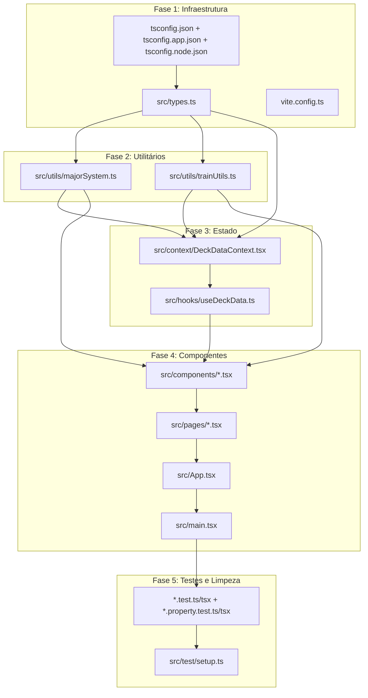
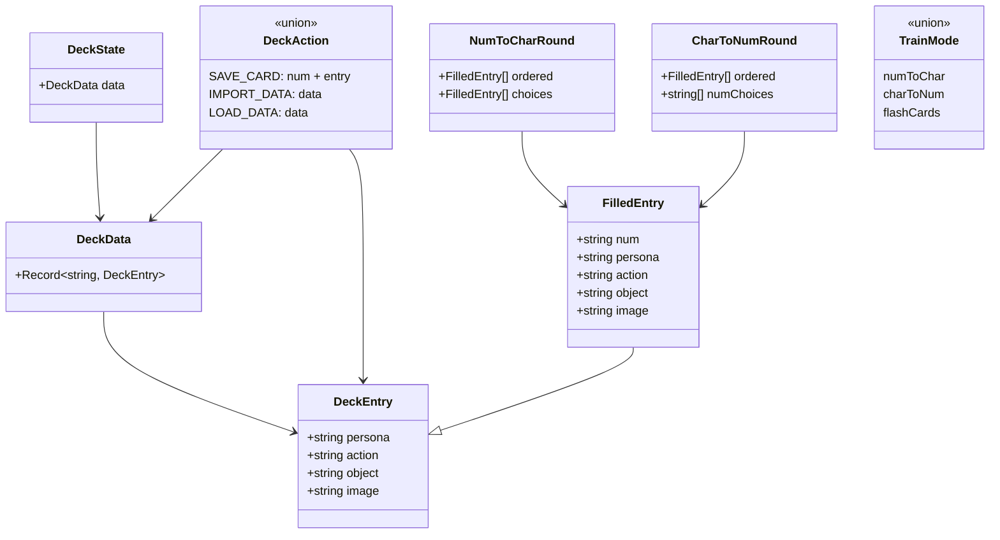

# Design — Migração para TypeScript

## Visão Geral

Este documento descreve o design técnico para migrar o projeto Memory Deck de JavaScript (JSX/JS) para TypeScript (TSX/TS). A migração é incremental e segue uma ordem de dependências: primeiro a infraestrutura (config, tipos), depois os módulos utilitários (sem dependência de React), em seguida o contexto/hooks, depois os componentes React, e por fim os testes e limpeza.

O projeto atual usa React 19, Vite 6, React Router 7, Vitest e fast-check. A migração não altera nenhuma lógica de negócio — apenas adiciona tipagem estática ao código existente.

### Decisões de Design

1. **Migração incremental por camadas**: Seguir a ordem tipos → utils → context/hooks → componentes → testes para que cada camada já tenha suas dependências tipadas quando for migrada.
2. **Tipos centralizados em `src/types.ts`**: Evitar duplicação de interfaces entre módulos.
3. **Interfaces de props explícitas**: Cada componente React terá uma interface `XxxProps` definida no próprio arquivo.
4. **`tsconfig` com configuração estrita**: Usar `strict: true` para máximo benefício da tipagem.
5. **Manter `fast-check` como biblioteca de property-based testing**: Já está instalada e em uso no projeto.

## Arquitetura

A arquitetura do projeto não muda com a migração. O diagrama abaixo mostra a estrutura de dependências entre módulos e a ordem de migração:



## Componentes e Interfaces

### Arquivo de Tipos Centralizados (`src/types.ts`)

```typescript
export interface DeckEntry {
  persona: string;
  action: string;
  object: string;
  image: string;
}

export type DeckData = Record<string, DeckEntry>;

export type TrainMode = 'numToChar' | 'charToNum' | 'flashCards';
```

### Tipos dos Módulos Utilitários

**`src/utils/majorSystem.ts`**:
```typescript
export type MajorMap = Record<number, string[]>;

export interface ConsonantsResult {
  first: string[];
  second: string[];
  label: string;
}

export const MAJOR: MajorMap;
export function getConsonants(num: number): ConsonantsResult;
export function extractMajorConsonants(name: string): string[];
```

**`src/utils/trainUtils.ts`**:
```typescript
import { DeckEntry, TrainMode } from '../types';

export interface FilledEntry extends DeckEntry {
  num: string;
}

export interface NumToCharRound {
  ordered: FilledEntry[];
  choices: FilledEntry[];
}

export interface CharToNumRound {
  ordered: FilledEntry[];
  numChoices: string[];
}

export interface ProgressInfo {
  label: string;
  percentage: number;
}

export function shuffle<T>(arr: T[]): T[];
export function randomNum(exclude: Set<string>): string;
export function generateNumToCharRound(filledEntries: FilledEntry[]): NumToCharRound;
export function generateCharToNumRound(filledEntries: FilledEntry[]): CharToNumRound;
export function getResultEmoji(score: number, totalRounds: number): string;
export function calculateProgress(currentIndex: number, total: number): ProgressInfo;
export function isStartEnabled(mode: TrainMode, filledCount: number): boolean;
```

### Tipos do Contexto e Hooks

**`src/context/DeckDataContext.tsx`**:
```typescript
import { DeckData, DeckEntry } from '../types';

export interface DeckState {
  data: DeckData;
}

export type DeckAction =
  | { type: 'SAVE_CARD'; num: string; entry: DeckEntry }
  | { type: 'IMPORT_DATA'; data: DeckData }
  | { type: 'LOAD_DATA'; data: DeckData };

export interface DeckDataContextValue {
  state: DeckState;
  dispatch: React.Dispatch<DeckAction>;
}
```

**`src/hooks/useDeckData.ts`**:
```typescript
import { DeckData, DeckEntry } from '../types';
import { FilledEntry } from '../utils/trainUtils';

export interface UseDeckDataReturn {
  data: DeckData;
  saveCard: (num: string, entry: DeckEntry) => void;
  importData: (data: DeckData) => void;
  getFilledEntries: () => FilledEntry[];
}
```

### Interfaces de Props dos Componentes

| Componente | Interface de Props |
|---|---|
| `CardItem` | `{ num: string; entry: Partial<DeckEntry>; onClick: (num: string) => void }` |
| `CardSection` | `{ start: number; end: number; cards: { num: string; entry: Partial<DeckEntry> }[]; filledCount: number; onCardClick: (num: string) => void }` |
| `CardGrid` | `{ data: DeckData; filter: string; onCardClick: (num: string) => void }` |
| `EditModal` | `{ isOpen: boolean; cardNum: number \| string \| null; entry: Partial<DeckEntry>; onSave: (num: number \| string, entry: DeckEntry) => void; onClose: () => void }` |
| `SearchBar` | `{ onSearch: (value: string) => void }` |
| `ProgressBar` | `{}` (sem props, usa hook) |
| `ImportExportControls` | `{}` (sem props, usa hook) |
| `Header` | `{}` (sem props, usa react-router) |
| `TrainSetup` | `{ filledCount: number; mode: TrainMode; onModeChange: (mode: TrainMode) => void; onStart: () => void }` |
| `NumToCharChallenge` | `{ filledEntries: FilledEntry[]; onComplete: (score: number) => void }` |
| `CharToNumChallenge` | `{ filledEntries: FilledEntry[]; onComplete: (score: number) => void }` |
| `FlashCards` | `{ filledEntries: FilledEntry[]; onComplete: (cardCount: number) => void }` |
| `ResultScreen` | `{ mode: TrainMode; score: number; totalRounds: number; totalCards: number; onRetry: () => void }` |

## Modelos de Dados

Os modelos de dados do projeto não mudam com a migração. A tipagem formaliza o que já existe implicitamente:



### Persistência

O `localStorage` armazena `DeckData` serializado como JSON sob a chave `'pao-major-system'`. A migração não altera o formato de persistência — apenas tipifica as funções de leitura/escrita.

### Configuração TypeScript

**`tsconfig.json`** (base):
- `references` para `tsconfig.app.json` e `tsconfig.node.json`

**`tsconfig.app.json`**:
- `target`: `ES2020`
- `lib`: `["ES2020", "DOM", "DOM.Iterable"]`
- `module`: `ESNext`
- `moduleResolution`: `bundler`
- `jsx`: `react-jsx`
- `strict`: `true`
- `noUnusedLocals`: `true`
- `noUnusedParameters`: `true`
- `include`: `["src"]`

**`tsconfig.node.json`**:
- `include`: `["vite.config.ts"]`
- `module`: `ESNext`
- `moduleResolution`: `bundler`


## Propriedades de Corretude

*Uma propriedade é uma característica ou comportamento que deve ser verdadeiro em todas as execuções válidas de um sistema — essencialmente, uma declaração formal sobre o que o sistema deve fazer. Propriedades servem como ponte entre especificações legíveis por humanos e garantias de corretude verificáveis por máquina.*

A maioria dos requisitos desta migração são verificações em tempo de compilação (o TypeScript compila sem erros) ou verificações de estrutura de arquivos (arquivos renomeados, configs criados). Esses não são testáveis como propriedades em tempo de execução. A propriedade central desta migração é a preservação de comportamento.

### Propriedade 1: Preservação de comportamento das funções migradas

*Para qualquer* entrada válida de qualquer função utilitária migrada (`shuffle`, `randomNum`, `generateNumToCharRound`, `generateCharToNumRound`, `getResultEmoji`, `calculateProgress`, `isStartEnabled`, `getConsonants`, `extractMajorConsonants`) e para qualquer ação válida do reducer (`SAVE_CARD`, `IMPORT_DATA`, `LOAD_DATA`), a versão TypeScript deve produzir exatamente o mesmo resultado que a versão JavaScript original.

**Valida: Requisitos 3.5, 4.5, 8.3**

> Nota: Esta propriedade é validada indiretamente pelos testes de propriedade existentes (Properties 1-14 da migração React anterior). Se todos os property tests existentes passam após a migração para TypeScript, a preservação de comportamento está garantida. Não é necessário criar novos property tests — apenas migrar os existentes para `.ts`/`.tsx` e verificar que continuam passando.

## Tratamento de Erros

### Erros de Compilação

- O `tsc --noEmit` deve ser executado como verificação após cada fase da migração
- Erros de tipo devem ser corrigidos antes de prosseguir para a próxima fase
- O Vite já integra verificação de tipos via plugin React

### Erros de Runtime

- Nenhum erro de runtime novo deve ser introduzido pela migração
- O `DeckDataContext` deve manter o tratamento de `try/catch` no `loadFromStorage`
- O `ImportExportControls` deve manter o `try/catch` no parsing de JSON importado
- O `EditModal` deve manter o tratamento de erro de clipboard (`navigator.clipboard.readText`)

### Erros de Tipo Comuns na Migração

| Cenário | Solução |
|---|---|
| `entry` pode ser `undefined` em `data[num]` | Usar `Partial<DeckEntry>` ou `DeckEntry \| undefined` |
| `cardNum` pode ser `null` no `EditModal` | Manter tipo `number \| string \| null` |
| `e.target.result` no `FileReader` | Cast para `string` via `ev.target?.result as string` |
| `document.getElementById('root')` pode ser `null` | Usar non-null assertion `!` no `main.tsx` |
| `onError` em `` recebe `SyntheticEvent` | Tipar o parâmetro como `React.SyntheticEvent<HTMLImageElement>` |

## Estratégia de Testes

### Abordagem

A migração não requer novos testes de lógica — o objetivo é migrar os testes existentes para TypeScript e verificar que todos continuam passando. A estratégia é:

1. **Testes unitários existentes**: Migrar de `.test.js`/`.test.jsx` para `.test.ts`/`.test.tsx` adicionando tipagem aos mocks e fixtures
2. **Testes de propriedade existentes**: Migrar de `.property.test.js`/`.property.test.jsx` para `.property.test.ts`/`.property.test.tsx` adicionando tipagem aos arbitrários do fast-check
3. **Verificação de compilação**: Executar `npx tsc --noEmit` como teste adicional de corretude estática

### Biblioteca de Property-Based Testing

O projeto já usa **fast-check** (v4.1.1) que tem suporte nativo a TypeScript. Os arbitrários (`fc.record`, `fc.string`, etc.) já são genéricos e inferem tipos automaticamente.

### Configuração dos Testes de Propriedade

- Mínimo de **100 iterações** por teste de propriedade (já configurado com `{ numRuns: 100 }`)
- Cada teste de propriedade deve manter o comentário de referência ao design
- Formato do tag: **Feature: typescript-migration, Property 1: Preservação de comportamento das funções migradas**

### Testes Unitários vs Testes de Propriedade

- **Testes unitários**: Verificam exemplos específicos, edge cases e integração entre componentes (ex: `majorSystem.test.js`, `App.test.jsx`, `DeckPage.test.jsx`)
- **Testes de propriedade**: Verificam propriedades universais com entradas aleatórias (ex: todos os `*.property.test.*`)
- Ambos são complementares e já existem no projeto — a migração apenas adiciona tipagem

### Verificação Pós-Migração

Após cada fase da migração, executar:
1. `npx tsc --noEmit` — verificação de tipos
2. `npm test` — todos os testes devem passar
3. `npm run build` — build de produção deve completar sem erros
